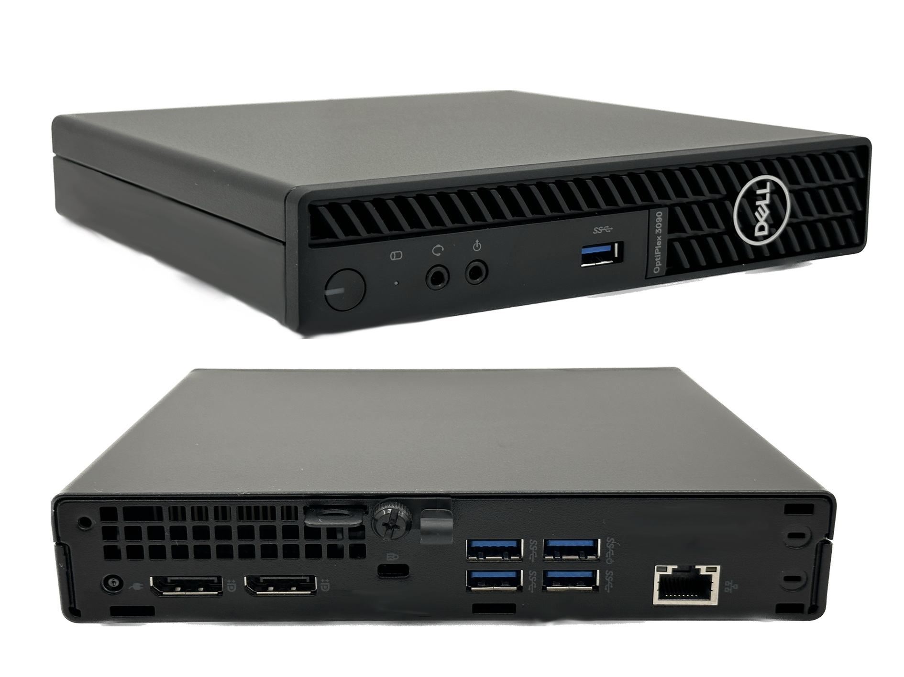

# DELL 3090 MFF Hackintosh OpenCore EFI

This fork contains a customised setup for DELL Optiplex 3090 MFF with a Intel Core i3 Processor
macOS Sonoma 14.0 worked maybe earlier macOS versions will still running too

谢谢 and BigUP the guys from [Hackintosh.Club](https://github.com/hackintosh-club) for share they work with us
Thanks gatorback from [tonymacx86.com ](https://www.tonymacx86.com/) for 

### (README.txt)

### OpenCore

[OpenCore 0.9.5](https://github.com/acidanthera/OpenCorePkg)

### OS Version Tested

- macOS Sonoma  14.0

### Hardware

- Motherboard: DELL Q470
- Bios Version: 2.4.0 - 2.14.0
- CPU: Intel i3-10105T
- RAM: Samsung 2x16GB DDR4 3200
- SSD: Samsung 970 EVO Plus 1 TB SSD M.2 via NVMe
- iGPU: Intel UHD Graphic 630
- Audio: Realtek ALC256
- Ethernet Card: Intel I219-LM CMP(11)
- Wireless: xxxxxxxxxx
- PSU: DELL 65W
- Display Connectors: 2 DisplayPort 1.4
  
### Bios Setup

| Name | Option |
| ----- | --- |
| System Configuration → SATA Operation | AHCI |
| Security → PTT Security/PTT On | Disabled |
| Secure Boot → Secure Boot Enable | Disabled |
| PSecure Boot → Secure Boot Mode | Audit Mode |
| Intel Software Guard Extensions → Intel SGX Enable | Enable |
| Power Management → Deep Sleep Control | Disabled |
| Power Management → USB Wake Support | Disabled |
| Power Management → Wake on LAN/WLAN | Lan only |
| Power Management → Block Sleep | Enable |
| POST Behavior → Fastboot | Thorough |
| Virtualization Support → VT For Direct I/O | Enable |

### Notes
 - Use [OpenCore Configurator](https://mackie100projects.altervista.org/opencore-configurator/) build your own SMBIOS

 - Use [RU.efi](http://ruexe.blogspot.com/) Unlock CFG LOCK , Change DVMT = 64MB

| Option | UEFI Variable Name | Address | Default | Replace |
| --- | --- | --- | --- | --- |
| CFG LOCK | CPUSetup | 0x3E | 0x1 | 0x0 |
| DVMT | SaSetup | 0xF5 | 0x0 | 0x2 |

- Unlock CFG LOCK Address:0x3E  01 (Enabled) Replace 00（Disabled）

- Change DVMT Address:0xF5  00（Default） Replace 02（64MB）

### ScreenShot 

- About This Mac

- Geekbench5 Score i3-10105T 

- Ventura 13.6 (22G120) 

