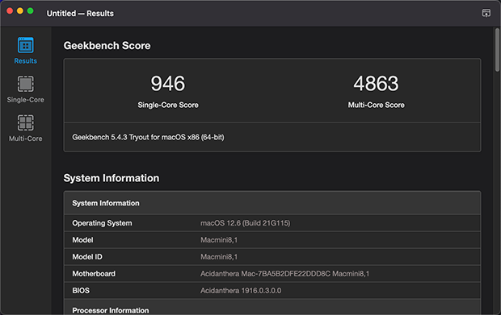

# DELL 3090 MFF Hackintosh OpenCore EFI

### [简体中文](README.zh_CN.md)

### OpenCore

[OpenCore 0.9.5](https://github.com/acidanthera/OpenCorePkg)

### OS Version Tested

- macOS Monterey 12.x
- macOS Ventura  13.x 
- macOS Sonoma  14.x 

### Hardware

- Motherboard: DELL Q470
- Bios Version: 2.4.0
- CPU: Intel i5-10500t
- RAM: Samsung 2x16GB DDR4 3200
- SSD: West Digital SN750 500G
- iGPU: Intel UHD Graphic 630
- Audio: Realtek ALC256
- Ethernet Card: Realtek PCle GbE Family Controller
- Wireless: BCM94360CS2
- PSU: DELL 65W 

### Bios Setup

| Name | Option |
| ----- | --- |
| System Configuration → SATA Operation | AHCI |
| Security → PTT Security/PTT On | Disabled |
| Secure Boot → Secure Boot Enable | Disabled |
| PSecure Boot → Secure Boot Mode | Audit Mode |
| Intel Software Guard Extensions → Intel SGX Enable | Disabled |
| Power Management → Deep Sleep Control | Disabled |
| Power Management → USB Wake Support | Disabled |
| Power Management → Wake on LAN/WLAN | Lan only |
| Power Management → Block Sleep | Disabled |
| POST Behavior → Fastboot | Minimal |
| Virtualization Support → VT For Direct I/O | Disabled |

### Notes
 - Use [OpenCore Configurator](https://mackie100projects.altervista.org/opencore-configurator/) build your own SMBIOS

 - Use [RU.efi](http://ruexe.blogspot.com/) Unlock CFG LOCK , Change DVMT = 64MB

| Option | UEFI Variable Name | Address | Default | Replace |
| --- | --- | --- | --- | --- |
| CFG LOCK | CPUSetup | 0x3E | 0x1 | 0x0 |
| DVMT | SaSetup | 0xF5 | 0x0 | 0x2 |

- Unlock CFG LOCK Address:0x3E  01 (Enabled) Replace 00（Disabled）

- Change DVMT Address:0xF5  00（Default） Replace 02（64MB）

### ScreenShot 

- About This Mac

- Geekbench5 Score i5-10500T 

- Ventura 13.6 (22G120) 

### Contact Us 

- QQ Group: 23304408

