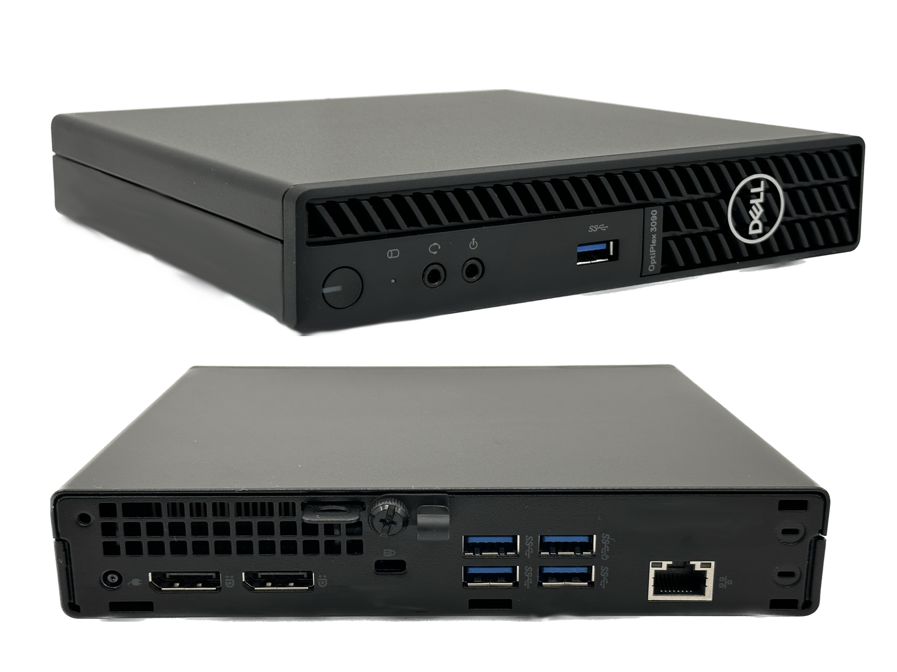
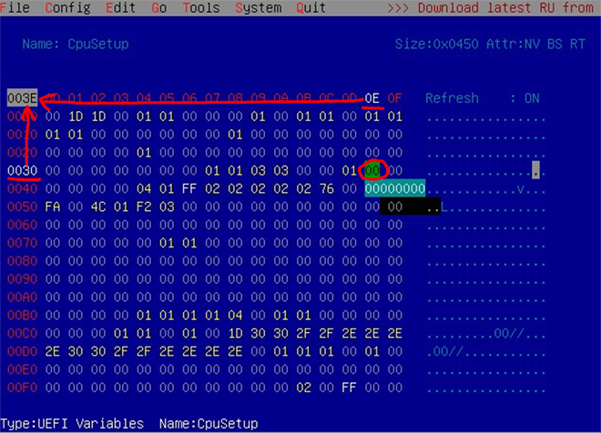
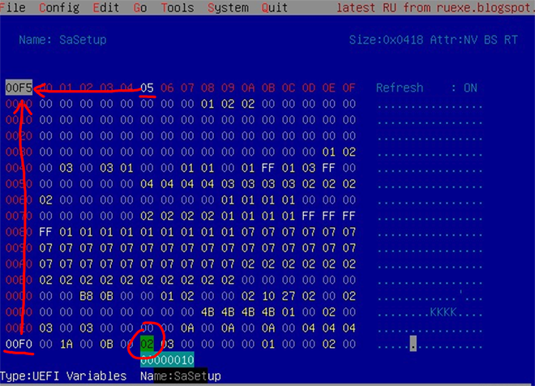
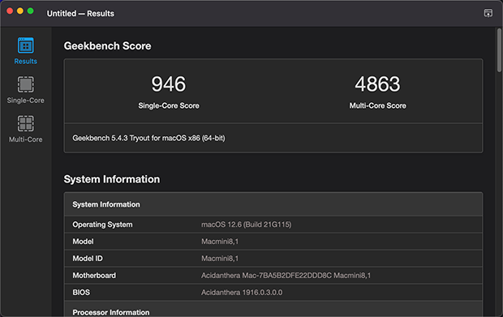
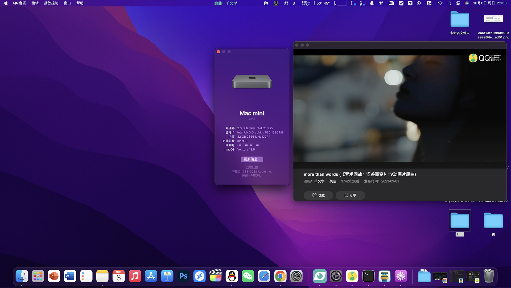

# DELL 3090 MFF 黑苹果 OpenCore EFI

### OpenCore

[OpenCore 0.8.9](https://github.com/acidanthera/OpenCorePkg)

### 可安装系统

- macOS Monterey 12.x 
- macOS Ventura  13.x 

### 硬件

- 主板: 戴尔 Q470
- Bios版本: 2.4.0
- 处理器: 英特尔 i5-10500t
- 内存: 三星 2x16GB DDR4 3200
- 硬盘: 西部数据 SN750 500G
- 核显: 英特超核心显卡 630
- 声卡: 瑞昱 ALC256
- 网卡: 瑞昱 PCle 千兆网络控制器
- 无线: 博通94360CS2 白果拆机卡+反向转接板
- 电源: 戴尔 65W

### Bios 设置

| 名称 | 选项 |
| ----- | --- |
| System Configuration → SATA Operation | AHCI |
| Security → PTT Security/PTT On | 禁用 |
| Secure Boot → Secure Boot Enable | 禁用 |
| PSecure Boot → Secure Boot Mode | Audit Mode 审核模式 |
| Intel Software Guard Extensions → Intel SGX Enable | 禁用 |
| Power Management → Deep Sleep Control | 禁用 |
| Power Management → USB Wake Support | 禁用 |
| Power Management → Wake on LAN/WLAN | Lan only 仅LAN|
| Power Management → Block Sleep | 禁用 |
| POST Behavior → Fastboot | Minimal |
| Virtualization Support → VT For Direct I/O | 禁用 |

### 注意事项

 - 使用 [OpenCore Configurator](https://mackie100projects.altervista.org/opencore-configurator/) 生成 SMBIOS
 - 使用 [RU.efi](http://ruexe.blogspot.com/) 解锁 CFG LOCK , 修改核显 DVMT = 64兆
 
 | 选项 | UEFI Variable Name | 地址 | 默认值 | 替换值 |
 | --- | --- | --- | --- | --- |
 | CFG LOCK | CPUSetup | 0x3E | 0x1 | 0x0 |
 | DVMT | SaSetup | 0xF5 | 0x0 | 0x2 |
 
 - 解锁CFG LOCK 地址:0x3E  01 (Enabled 默认为开启) 修改为 00（Disabled 禁用）

 - 修改核显 DVMT 地址:0xF5  00（Default 默认值） 修改为 02（64兆）

 
### 系统截图

- 关于本机

- Geekbench5 跑分 i5-10500T 

- Ventura Beta7 (22A5342f) 

